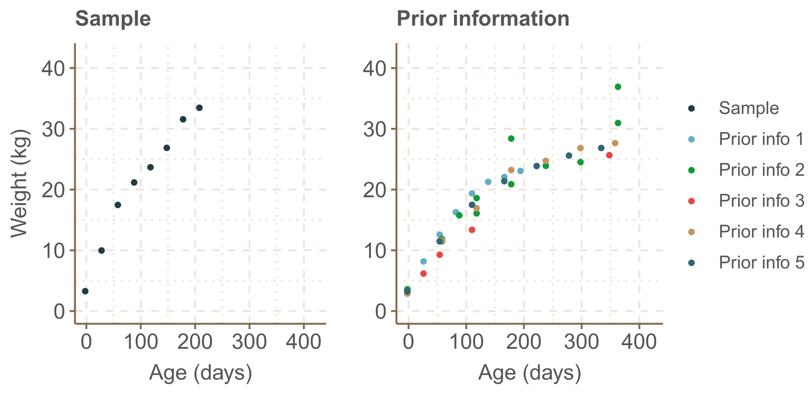
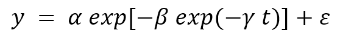
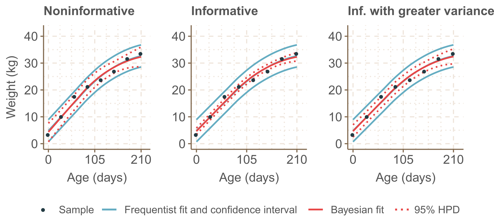

# Bayesian Growth Modelling
Research project aimed at modelling the growht (weight) of animals via frequentist and Bayesian approaches.
This study is waiting to be published in a journal. Once published, further details about the data and methodology and also a link to the paper will be provided.
The R_script contains the full methodology and its execution.

## Data
The sample comprises recently observed data. The prior information are previous observations of data.
Sample is used in frequentist approach, while Bayesian approach uses sample combined with prior information.

## Model
The Gompertz model was used to describe growht:

where *y* represents the weight, in kg; *t* is the age, in days; *α*, *β* and *γ* are the model parameters; and *ε* is the random error, being that *ε* ~ *N*(0,σ2) .

In Bayesian approach, the prior information was used to define prior distributions of the parameters of the model.
Three options of prior distributions were tested:
• Non-informative (no influence on model fit).
• Informative (considerable influence on model fit).
• Informative with greater variance (moderate influence on model fit).

## Results
Both frequentist and Bayesian approaches presented similar goodness of fit.

Bayesian approach using informative prior left observed values outside 95% HPD.
The HPD 95% is the narrowest interval in the credible interval (Bayesian equivalent of the confidence interval) which contains 95% of the probable values of the studied parameter (weight).
Bayesian approach using informative prior with greater variance presented slightly better goodness of fit and precision.
